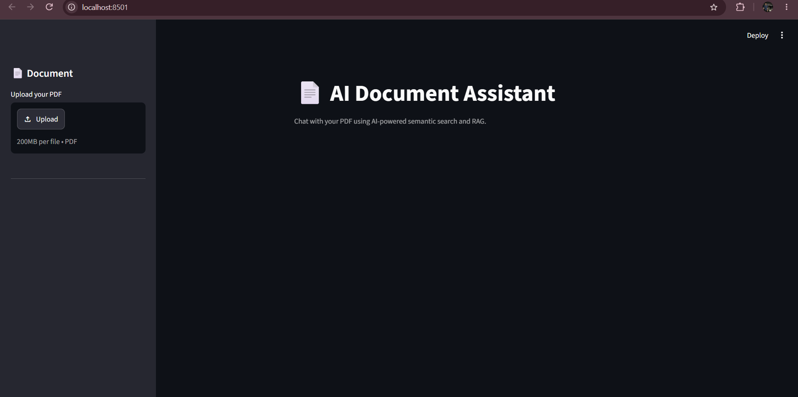
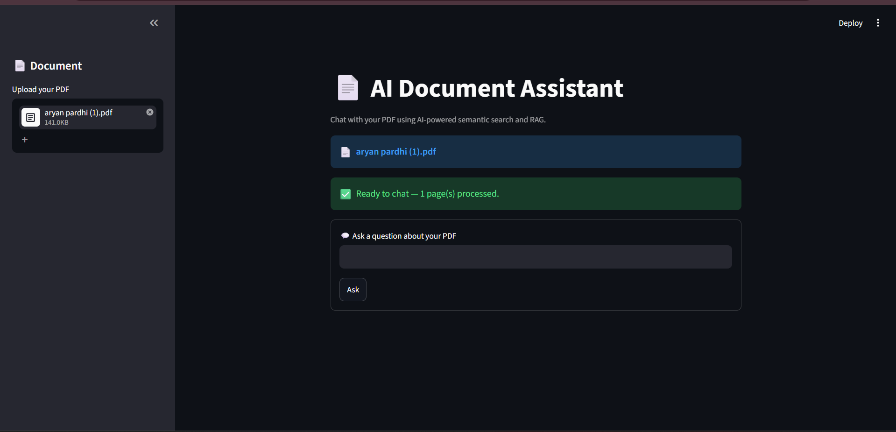
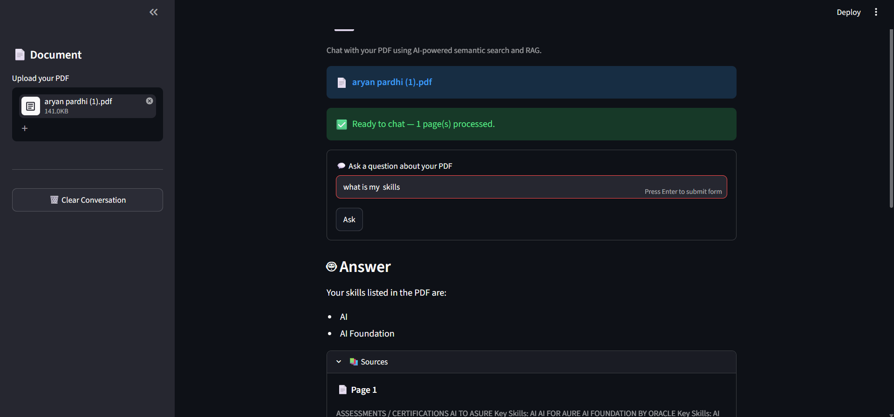

# 📄 AI Document Assistant

An AI-powered PDF chatbot that allows users to upload a PDF and ask questions about its content using Retrieval-Augmented Generation (RAG).

## 🚀 Features

- 📄 Upload and process PDF documents
- 🔍 Semantic search using vector embeddings
- 🧠 Retrieval-Augmented Generation (RAG)
- 💬 Conversational follow-up questions
- 📚 Source and page citations
- ⚡ FAISS vector database for fast similarity search
- 🤖 Groq-powered LLM responses
- 🔐 Environment-based API key management
- 💾 Cached PDF processing for better performance
- 🗑️ PDF-specific conversation history
- 🛡️ PDF-only answers to reduce hallucinations

## 🏗️ Tech Stack

- **Python**
- **Streamlit** — Web interface
- **LangChain** — RAG pipeline
- **FAISS** — Vector similarity search
- **HuggingFace Embeddings** — Document embeddings
- **Groq** — LLM inference
- **PyPDF** — PDF text extraction

## 🔄 How It Works

```text
                    PDF Upload
                        │
                        ▼
                 PDF Text Extraction
                        │
                        ▼
                 Text Chunking
                        │
                        ▼
             HuggingFace Embeddings
                        │
                        ▼
                  FAISS Vector Store
                        │
                        ▼
                  User Question
                        │
                        ▼
              Question Rewriting
                 (for follow-ups)
                        │
                        ▼
                 Semantic Search
                        │
                        ▼
                Relevant PDF Chunks
                        │
                        ▼
                    Groq LLM
                        │
                        ▼
                 Final Answer
                        │
                        ▼
              Source / Page Citations
```

## 🔄 RAG Pipeline

The application follows a Retrieval-Augmented Generation (RAG) pipeline.

### 1. PDF Upload

The user uploads a PDF through the Streamlit interface.

### 2. Text Extraction

`PyPDFLoader` extracts readable text from the PDF.

### 3. Text Chunking

The extracted text is divided into smaller chunks using `RecursiveCharacterTextSplitter`.

- Chunk size: 500 characters
- Chunk overlap: 50 characters

### 4. Embedding Generation

Each text chunk is converted into a vector embedding using:

`sentence-transformers/all-MiniLM-L6-v2`

### 5. Vector Storage

The generated embeddings are stored in a FAISS vector database for semantic similarity search.

### 6. Question Processing

The user asks a question about the uploaded PDF.

For follow-up questions, the system uses the previous conversation history to rewrite the question into a standalone search query.

### 7. Similarity Search

FAISS performs semantic similarity search and retrieves the most relevant PDF chunks.

### 8. Context Filtering

Retrieved chunks are filtered using a similarity threshold so that less relevant information is not passed to the LLM.

### 9. Answer Generation

The retrieved PDF context and the user's question are sent to the Groq LLM.

The model is instructed to:

- Use only the provided PDF context
- Avoid using external knowledge
- Avoid guessing or inventing information
- Clearly state when the information cannot be found in the PDF

### 10. Source Citations

The application displays the PDF page numbers and retrieved text used as sources for the answer.

## 📸 Screenshots

### Main Interface



### PDF Question Answering



### Source Citations



## ⚙️ Installation

### 1. Clone the repository

```bash
git clone https://github.com/aryan877pardhi/ai-document-assistant.git
cd ai-document-assistant
```

### 2. Create a virtual environment

```bash
python -m venv .venv
```

### 3. Activate the virtual environment

#### Windows

```bash
.venv\Scripts\activate
```

#### Linux / macOS

```bash
source .venv/bin/activate
```

### 4. Install dependencies

```bash
pip install -r requirements.txt
```

### 5. Configure the API key

Create a `.env` file in the project root:

```env
GROQ_API_KEY=your_groq_api_key
```

> Never commit your `.env` file or your API key to GitHub.

### 6. Run the application

```bash
streamlit run app.py
```

The application will open in your browser.

## 🔐 Environment Variables

The application requires the following environment variable:

```text
GROQ_API_KEY
```

You can use the provided `.env.example` file as a reference.

## 📂 Project Structure

```text
ai-document-assistant/
│
├── app.py
├── rag.py
├── requirements.txt
├── README.md
├── .env.example
├── .gitignore
│
└── screenshots/
    ├── main.png
    ├── answer.png
    └── source.png
```

## 🔮 Future Improvements

- 📚 Multiple PDF support
- 🔎 Advanced document reranking
- 📊 RAG evaluation metrics
- 🗂️ Document management
- 🌐 Cloud deployment
- 👥 Multi-user support
- 📈 Retrieval and response monitoring
- 🔐 User authentication

## 👨‍💻 Author

**Aryan Pardhi**

B.Tech — Artificial Intelligence & Machine Learning

---

⭐ If you find this project useful, consider giving it a star!